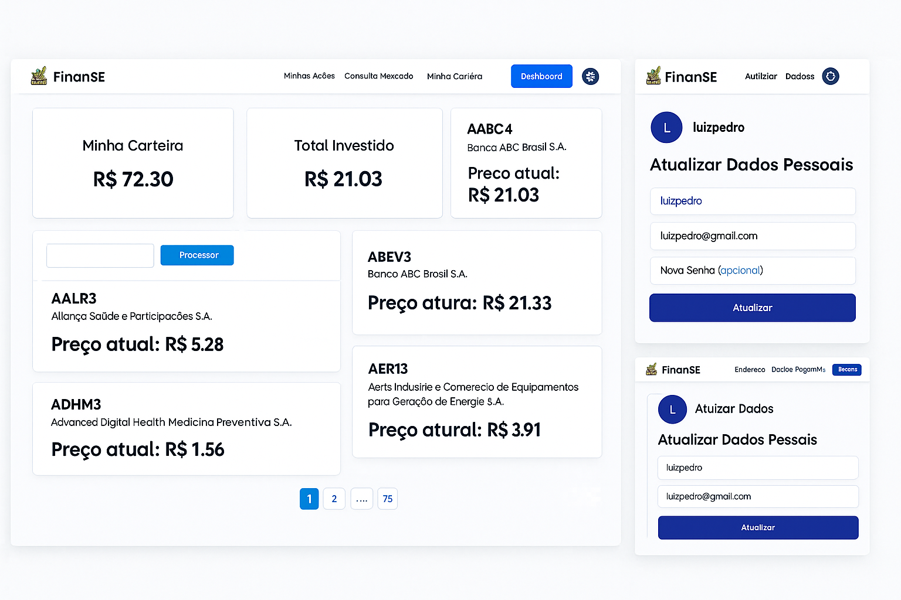

# 💸 FinanSE — Gerenciador de Carteiras de Ações

FinanSE é uma aplicação web responsiva e moderna desenvolvida para facilitar o controle de carteiras de ações. Com uma interface limpa e intuitiva, o sistema permite visualizar investimentos, acompanhar o saldo e consultar ações de forma prática.

---

## 📸 Preview

A imagem abaixo é uma **montagem** ilustrativa que reúne as principais telas do sistema em uma única visualização. Ela foi otimizada para uso em README, de forma a resumir o funcionamento e o visual da aplicação de forma clara e objetiva:

---

## 🧩 Sobre o Projeto

O objetivo do FinanSE é proporcionar uma experiência leve e acessível para qualquer usuário que deseje monitorar seus investimentos em ações. A aplicação simula:

- Saldo da carteira
- Total investido
- Quantidade de ações
- Saldos positivos/negativos
- Consulta de mercado
- Gerenciamento de perfil

---

## 🚀 Funcionalidades

✅ Dashboard financeiro com resumo em tempo real  
✅ Botão de ação para adicionar novos investimentos  
✅ Consulta de ações com layout de cards  
✅ Tela de perfil para editar dados pessoais  
✅ Layout responsivo e acessível

---

## 🖥️ Tecnologias Utilizadas

- **HTML5**
- **CSS3**
- **JavaScript (Vanilla)**
- **Node.js**
- _(Opcional: Express ou servidor local leve)_

---

## ⚙️ Como Executar

Para rodar o projeto localmente, certifique-se de ter o Node.js instalado. Após clonar o repositório, acesse a pasta do projeto, instale as dependências com `npm install` e inicie o servidor com `node server.js`. O sistema estará disponível no navegador pelo endereço `http://localhost:3000`. Caso utilize outro servidor local, como o `http-server`, você pode rodá-lo dentro da pasta `public` com o comando `npx http-server ./public` e acessar pelo endereço fornecido no terminal.

---

## 📐 Layout

A interface foi inspirada em aplicações financeiras modernas, com:

- Design minimalista
- Paleta clean com tons claros e tipografia elegante
- Componentes centralizados e responsivos

---

## 🌱 Possíveis Melhorias Futuras

- Integração com API de mercado financeiro em tempo real
- Modal para adicionar ações com formulário interativo
- Autenticação de usuários
- Exportação de relatórios em PDF/CSV
- Dark mode
- Testes unitários com Jest

---

## 🔒 Segurança

> Nenhum dado real é enviado ou armazenado.  
> Este projeto é apenas uma simulação visual e funcional para fins de estudo ou prototipagem.

---

## 📄 Licença

Este projeto está licenciado sob a Licença MIT.  
Veja o arquivo `LICENSE` para mais detalhes.

---

## 🙋‍♂️ Autor

Dono - BackEnd[George](https://github.com/Georgelxll)  
Colaborador - FrontEnd [Luiz Pedro](https://github.com/luuizpeedro)
